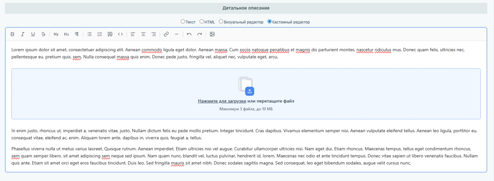

# Tiptap WYSIWYG — модуль для 1С-Битрикс / Bitrix24

[](https://tiptap.dev)
[](#требования)
[](LICENSE)

Заменяет штатный визуальный редактор Битрикса на [Tiptap 2.10](https://tiptap.dev)
(headless-редактор на базе ProseMirror) для полей `DETAIL_TEXT`, `PREVIEW_TEXT`
и пользовательских свойств типа `HTML`/`HTML_EDITOR`/`TEXT` в инфоблоках.

## Демо



На скриншоте — поле «Детальное описание» инфоблока. Тип поля переключён на
**«Кастомный редактор»** (радио добавляется модулем рядом с «Текст / HTML /
Визуальный редактор»). Поддерживается мульти-загрузка фото (до 3 файлов, до
10 МБ каждый) с drag-and-drop.

## Возможности

- 🔌 Подключается как отдельный тип поля в штатном переключателе Битрикса — не ломает существующие «Текст / HTML / Визуальный редактор».
- 🖼 Drag-and-drop загрузка изображений через собственный PHP-контроллер (`POST /services/my_tiptap/upload/`).
- ⌨️ Тулбар в стиле **Tiptap Simple Editor** (иконки lucide, pill-shape, stroke-width 1.5).
- 🇷🇺 Полностью русскоязычный UI.
- 🧱 Бандл собран локально (esbuild, IIFE) — **никаких CDN** в рантайме.
- 🪶 Минимум зависимостей на бэке: `CModule` + пара классов, без Composer.

## Требования

- 1С-Битрикс: Управление сайтом / Битрикс24 (коробка) **≥ 20.0**
- PHP **≥ 8.1** (желательно 8.2+)
- Права на установку модулей и запись в `/upload/my_tiptap/`

## Установка

1. Скопировать каталог `my.tiptap/` в `/bitrix/modules/` или `/local/modules/`.
2. `/bitrix/admin/partner_modules.php?lang=ru` → **Установить** модуль `my.tiptap`.
3. В настройках инфоблока у нужного поля выбрать тип **«Кастомный редактор»**.

## Структура репозитория

> Файлы модуля лежат **в корне** репозитория. Чтобы получить каталог
> `my.tiptap/` для Битрикса — скопируйте всё содержимое в
> `/local/modules/my.tiptap/` (или `/bitrix/modules/my.tiptap/`).

```
bitrix_tiptap_wysiwyg/
├── install/                  # инсталлятор модуля (CModule)
│   ├── index.php
│   └── version.php
├── lib/
│   ├── Config.php            # работа с опциями модуля
│   ├── Controller/
│   │   └── Upload.php        # контроллер загрузки фото (класс)
│   └── Event/
│       └── TiptapInjector.php # подключение JS+CSS в админке
├── ajax/
│   └── upload.php            # AJAX-эндпоинт загрузки
├── assets/
│   ├── js/
│   │   ├── tiptap-init.js    # инициализация Tiptap вместо textarea
│   │   ├── tiptap-loader.js  # fallback-загрузчик через esm.sh (если бандл не собран)
│   │   └── tiptap.bundle.js  # собранный локальный IIFE-бандл
│   ├── css/
│   │   └── tiptap.css        # стили обёртки и тулбара
│   └── build/                # исходники для пересборки бандла (esbuild)
│       ├── package.json
│       └── src/
│           ├── main.js
│           └── image-upload-node.js
├── admin/                    # админ-страница модуля
├── lang/ru/                  # локализация
├── docs/
│   └── screenshot.png
├── include.php               # bootstrap модуля
├── README.md
├── LICENSE
└── .gitignore
```

## Сборка бандла (опционально)

Готовый `assets/js/tiptap.bundle.js` уже лежит в репозитории. Чтобы
пересобрать его после правок в исходниках:

```bash
cd assets/build
npm install
npm run build         # минифицированный бандл
# или
npm run build:dev     # с sourcemap
npm run watch         # авто-пересборка
```

Сборка через **esbuild** (без Vite/Webpack). Выход — IIFE-бандл ~320 КБ,
который регистрирует `window.MTiptap = { Editor, StarterKit, ImageUploadNode, ... }`.

## Как это работает

1. **`install/index.php`** регистрирует:
   - обработчики `OnProlog / OnPageStart / OnAdminPageInit` → `My\Tiptap\Event\TiptapInjector::onAdminPageInit`;
   - URL-правило `^/services/my_tiptap/upload/` → `ajax/upload.php` (Bitrix24 **не** делает 302 на этот публичный путь, в отличие от `/local/modules/...`).
2. **`TiptapInjector`** подключает `tiptap.css` + `tiptap-init.js` только в админке.
3. **`tiptap-init.js`**:
   - сам грузит `tiptap.bundle.js` через `<script>`-инъекцию (Bitrix24 затирает `window.MTiptap` между `AddHeadScript`-вызовами, поэтому грузим сами);
   - добавляет радио **«Кастомный редактор»** в группу `.bx-ed-type-selector`;
   - на выбор радио — подменяет `<textarea>` Tiptap-инстансом;
   - синхронизирует содержимое обратно в `<textarea>` (и дублирует в скрытый `<input>` — Bitrix24 SPA иначе теряет значение).
4. **`ajax/upload.php`** принимает `multipart/form-data`, валидирует (≤3 файла, ≤10 МБ каждый, MIME image/*), сохраняет через `CFile::SaveFile` в `/upload/my_tiptap/`, возвращает `{ status, data: { url, id } }`.

## Опции модуля

Через **Настройки → Настройки продукта → Настройки модулей → Tiptap WYSIWYG** можно задать:

| Опция | По умолчанию | Описание |
|---|---|---|
| `max_files` | `3` | Максимум файлов за один drop |
| `max_size` | `10485760` | Макс. размер одного файла (10 МБ) |
| `upload_dir` | `my_tiptap` | Подкаталог в `/upload/` |
| `replace_uf_html` | `Y` | Подменять ли UF `HTML`/`HTML_EDITOR` |
| `extra_selectors` | `` | Доп. CSS-селекторы textarea через запятую |

## Возможные проблемы

| Симптом | Причина / Решение |
|---|---|
| Редактор не появляется | DevTools → Console: `[my.tiptap] Tiptap not loaded` — бандл не собран и CDN недоступен. |
| Изображения не загружаются | Права на `/upload/my_tiptap/`; 404 на `ajax/upload.php` = `.htaccess` блокирует; проверьте `upload_dir` (только латиница). |
| `CFile::SaveFile` возвращает false | Несуществующая директория или права на запись. |
| Редактор двоится | Поле обрабатывается и нашим JS, и штатным BX. Отключите штатный: `replace_uf_html = N` для конкретного свойства. |
| На мобильных не работает тулбар | Тулбар свёрстан под десктоп. Добавьте медиа-запросы в `tiptap.css` под себя. |

## Автор

**Минсафаев Таир** — [github.com/MTai88/bitrix_tiptap_wysiwyg](https://github.com/MTai88/bitrix_tiptap_wysiwyg)

## Лицензия

Код модуля — MIT. Tiptap — MIT ([tiptap.dev](https://tiptap.dev)). Используйте свободно.
